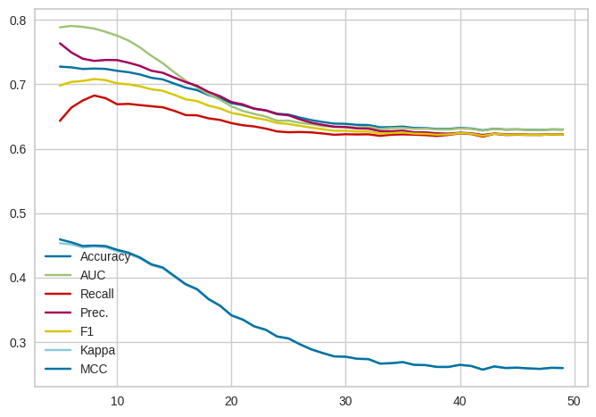
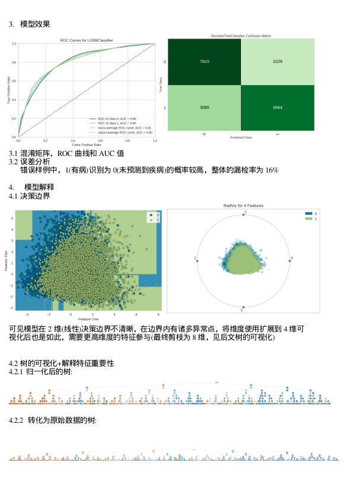
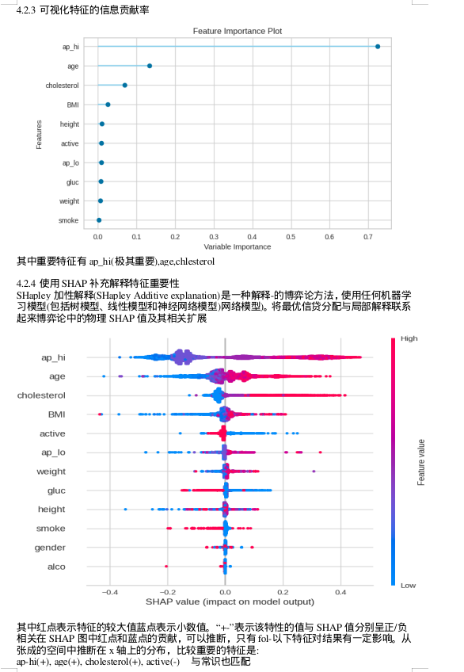

# ID3
数据挖掘课设，使用ID3/CART做二分类+可视化，含报告和PPT

定义了ID3，导入到pycaret框架的代码被注释了，所以你如果直接运行实际上跑的是CART(使用基尼系数)

## 运行环境
python3

## 环境配置

```
conda create -n id3 python=3.9
conda activate id3
pip install -r requirements.txt
pip install ipykernel
jupyter notebook
```

## 模型训练
通过遍历最大深度从0到50的模型的十折交叉验证的效果，获取最优的剪枝深度



## 模型效果



## 特征解释


## 文件目录

├── 计科2103王贺麟202112085.docx
├── 计科2103王贺麟202112085.pptx
├── cardio_train.csv
├── cardio_zscore.csv
├── decision_tree_origin.png
├── decision_tree.png
├── decision_tree.svg
├── LICENSE
├── logs.log
├── my_data.csv
├── my_data.xlsx
└── README.md

0 directories, 12 files

如果觉得有帮助，请点个star 🌟 